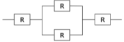

# 计算机基础-q-000087

## 题目

某计算机系统构成如下图所示，假设每个部件的千小时可靠度 R 为 0.95，则该系统的千小时可靠度约为（）。

## 选项

- **A.** 0.95 × [1 − (1 − 0.95)²] × 0.95

- **B.** 0.95 × (1 − 0.95)² × 0.95

- **C.** 0.95 × 2 × (1 − 0.95) × 0.95

- **D.** 0.95⁴ × (1 − 0.95)²

## 参考答案

- **A.** 0.95 × [1 − (1 − 0.95)²] × 0.95
