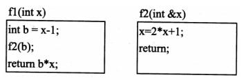

# 程序设计语言-q-000134

## 题目

调用函数时若是引用调用方式，则是将（请作答此空）。下面所定义的函数f1为值调用方式，函数f2为引用调用方式。若有表达式x=f1(5)，则函数调用执行完成后，该表达式中x获得的值为（2）。

## 选项

- **A.** 实参的值传给形参

- **B.** 形参的值传给实参

- **C.** 实参的地址传给形参

- **D.** 形参的地址传给实参

## 参考答案

- **C.** 实参的地址传给形参
