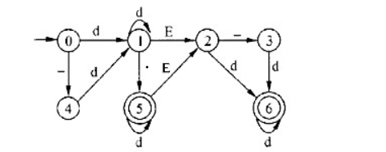

# 程序设计语言-q-000153

## 题目

某一确定性有限自动机(DFA)的状态转换图如下图所示，令d=0|1|2|…|19，则以下字符串中，不能被该DFA接受的是（请作答此空）。

（1）3857    （2）1.2E+5    （3）-123．    （4）.576E10

## 选项

- **A.** （1）、（2）、（3）

- **B.** （1）、（2）、（4）

- **C.** （2）、（3）、（4）

- **D.** （1）、（2）、（3）、（4）

## 参考答案

- **B.** （1）、（2）、（4）
