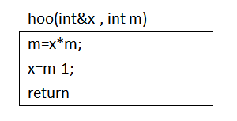

# 程序设计语言-q-000157

## 题目

22、设函数foo和hoo的定义如下图所示，在函数foo中调用函数hoo，hoo的第一个参数采用传引用方式.(call by reference)，第二个参数传值方式（call by value)，那么函数foo中的print(a，b)将输出（22）
foo ()
{
    int a=8,b=5;
    hoo(a,b);
    Print(a,b);
}

## 选项

- **A.** 8，5

- **B.** 39，5

- **C.** 8，40

- **D.** 39，40

## 参考答案

- **B.** 39，5
