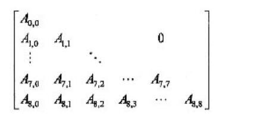
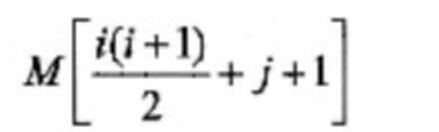
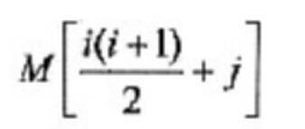
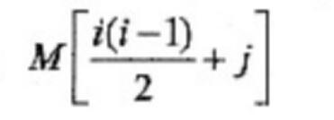
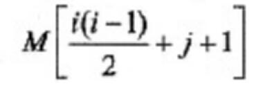

# 数据结构与算法-q-000220

## 题目

设下三角矩阵（上三角部分的元素值都为 0）A[0..n，0..n] 如下所示，将该三角矩阵的所有非零元素（即行下标不小于列下标的元素）按行优先压缩存储在容量足够大的数组 M 中（下标从 1 开始），则元素 A[i,j]（0≤i≤n，j≤i）存储在数组 M 的（ ）中。

## 选项

- **A.** 

- **B.** 

- **C.** 

- **D.** 

## 参考答案

- **A.** 
