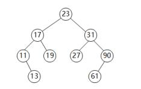

# 数据结构与算法-q-000230

## 题目

设有二叉排序树（或二叉查找树）如下图所示，建立该二叉树的关键码序列不可能是（）。

## 选项

- **A.** 23 31 17 19 11 27 13 90 61

- **B.** 23 17 19 31 27 90 61 11 13

- **C.** 23 17 27 19 31 13 11 90 61

- **D.** 23 31 90 61 27 17 19 11 13

## 参考答案

- **C.** 23 17 27 19 31 13 11 90 61
