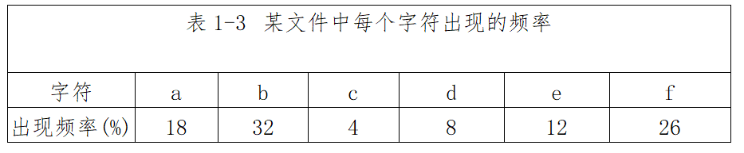

# 数据结构与算法-q-000239

## 题目

霍夫曼编码将频繁出现的字符采用短编码，出现频率较低的字符采用长编码。具体的操作过程为：i)以每个字符的出现频率作为关键字构建最小优先级队列；ii)取出关键字最小的两个结点生成子树，根节点的关键字为孩子节点关键字之和，并将根节点插入到最小优先级队列中，直至得到一棵最优编码树。
霍夫曼编码方案是基于（请作答此空）策略的。用该方案对包含a到f6个字符的文件进行编码，文件包含100000个字符，每个字符的出现频率(用百分比表示)如表1-3所示，则与固定长度编码相比，该编码方案节省了（2）存储空间。

## 选项

- **A.** 分治

- **B.** 贪心

- **C.** 动态规划

- **D.** 回溯

## 参考答案

- **B.** 贪心
