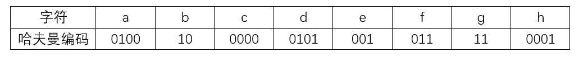

# 数据结构与算法-q-000247

## 题目

已知字符集为{a,b,c,d,e,f,g,h}，若各字符的哈夫曼编码如下表所，则对编码序列010101100011001001001111的译码结果为（）。

## 选项

- **A.** daceabdg

- **B.** dabccabg

- **C.** dfhbabfg

- **D.** dfaecbfg

## 参考答案

- **C.** dfhbabfg
