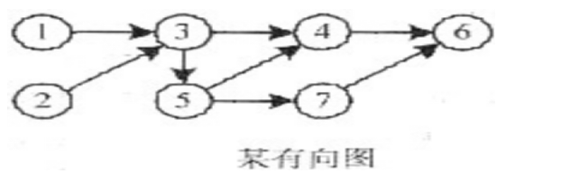

# 数据结构与算法-q-000264

## 题目

拓扑排序是将有向图中所有顶点排成一个线性序列的过程，并且该序列满足：若在 AOV 网中从顶点 vi 到 vj 有一条路径，则顶点 vi 必然在顶点 vj 之前。对于下图所示的有向图，（ ）是其拓扑序列。

## 选项

- **A.** 1 2 3 4 5 7 6

- **B.** 1 2 3 5 4 6 7

- **C.** 2 1 3 5 4 7 6

- **D.** 2 1 3 4 5 6 7

## 参考答案

- **C.** 2 1 3 5 4 7 6
