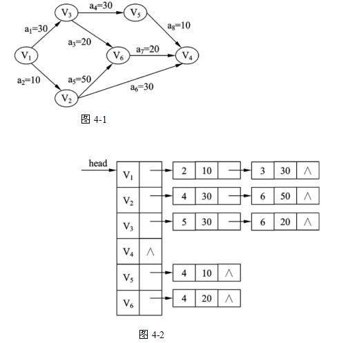

# 数据结构与算法-q-000277

## 题目

试题四（15分）
阅读下列函数说明和C代码，将应填入_（n） 处的字句写在答题纸的对应栏内。
【说明】
函数 int Toplogical(LinkedWDigraph G)的功能是对图 G中的顶点进行拓扑排序，并返回关键路径的长度。其中图G表示一个具有n个顶点的AOE-网，图中顶点从1~n依次编号，图 G的存储结构采用邻接表表示，其数据类型定义如下∶
typedef struct Gnode{       	/* 邻接表的表结点类型 */
int adjvex;                /* 邻接顶点编号 */
int weight;			    /* 弧上的权值 */
struct Gnode *nextArc;n    /* 指示下一个弧的结点 */
}Gnode;

typedef struct Adjlist{          /* 邻接表的头结点类型 */
char vdata;               /* 顶点的数据信息 */
struct Gnode *Firstadj;     /* 指向邻接表的第一个表结点 */
}Adjlist;

typedef struct LinkedWDigraph{	/* 图的类型*/
int n, e;					/* 图中顶点个数和边数 */
struct Adjlist *head;        /* 指向图中第一个顶点的邻接表的头结点 */

}LinkedwDigraph;

例如，某AOE-网如图4-1所示，其邻接表存储结构如图4-2所示。

【函数】
int Toplogical (LinkedWDigraph G)
{ Gnode *p;
int j,w,top = 0;
int *Stack,*ve,*indegree;
ve =(int *)malloc((G.n+1)* sizeof(int));
indegree =（int *）malloc（（G.n+1）*sizeof（int））; /*存储网中各顶点的入度*/
Stack =（int *）malloc（（G.n+1）*sizeof（int）））;  /*存储入度为0的顶点的编号*/
if(!ve | | !indegree || !Stack)exit (0);
for (j= 1;j<= G.n; j++){
ve[ j]= 0;indegree [ j]= 0;
}/*for*/
for(j=1;j<= G.n;j++){/* 求网中各顶点的入度 */
p= G.head[ j].Firstadj;
while (p){
(1)  ;p = p->nextArc;
}/*while*/
}/*for*/
for (j=l;j<= G.n;j++)/*求网中入度为0的顶点并保存其编号*/
if (!indegree[j])Stack[++top] = j;
while(top > 0){
  w= （2） ;
printf("%c ",G.head[w].vdata);
p = G.head[w].Firstadj;
while(p) {
 （3） ;
if(!indegree[p→adjvex])
Stack[++top] = p-adjvex;
if( （4） )
ve[p→adjvex] = ve[w]+ p→weight;
p = p→nextArc;
}/* while */
}/* while */
return （5） ;
}/*Toplogical*/

