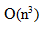

# 数据结构与算法-q-000332

## 题目

求解两个长度为n的序列X和Y的一个最长公共序列（如序列ABCBDAB和BDCABA的一个最长公共子序列为BCBA）可以采用多种计算方法。如可以采用蛮力法，对X的每一个子序列，判断其是否也是Y的子序列，最后求出最长的即可，该方法的时间复杂度为 （请作答此空） 。经分析发现该问题具有最优子序列，可以定义序列长度分别为i和j的两个序列X和Y的最长公共子序列的长度为C[i,j]，如下式所示。该方法的时间复杂度为 （2） 。
C[i,j] = { 0, 若i=0或j=0; C[i-1,j-1]+1, 若i,j>0且X_i=Y_j; max(C[i-1,j], C[i,j-1]), 其它 }

## 选项

- **A.** O(n2)

- **B.** O(n2lgn)

- **C.** 

- **D.** O(n2n)

## 参考答案

- **D.** O(n2n)
