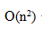
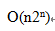

# 数据结构与算法-q-000333

## 题目

求解两个长度为 n 的序列 X 和 Y 的一个最长公共子序列（如序列 ABCBDAB 和 BDCABA 的一个最长公共子序列为 BCBA）可以采用多种计算方法。如可以采用蛮力法，对 X 的每一个子序列，判断其是否也是 Y 的子序列，最后求出最长的即可，该方法的时间复杂度为（ ）。经分析发现该问题具有最优子结构，可以定义序列长度分别为 i 和 j 的两个序列 X 和 Y 的最长公共子序列的长度为 C[i,j]，如下式所示。该方法的时间复杂度为（请作答此空）。
C[i,j]=\begin{cases}0,&i=0或j=0\\C[i−1,j−1]+1,&i>0且Xi=Yj\\max(C[i−1,j],C[i,j−1]),&其它\end{cases}

## 选项

- **A.** 

- **B.** O(n2lgn)

- **C.** O(n3)

- **D.** 

## 参考答案

- **A.** 
