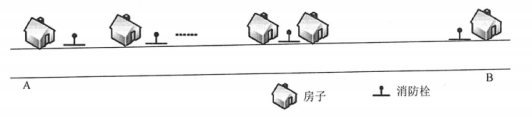

# 数据结构与算法-q-000369

## 题目

在一条笔直公路的一边有许多房子，现要安装消防栓，每个消防栓的覆盖范围远大于房子的面积，如下图所示。现求解能覆盖所有房子的最少消防栓数和安装方案（问题求解过程中，可将房子和消防栓均视为直线上的点）。

该问题求解算法的基本思路为：从左端的第一栋房子开始，在其右侧m米处安装一个消防栓，去掉被该消防栓覆盖的所有房子。在剩余的房子中重复上述操作，直到所有房子被覆盖。算法采用的设计策略为 （1） ；对应的时间复杂度为 （2） 。
假设公路起点A的坐标为0，消防栓的覆盖范围（半径）为20米，10栋房子的坐标为（10,20,30,35,60,80,160,210,260,300），单位为米。根据上述算法，共需要安装 （请作答此空） 个消防栓。以下关于该求解算法的叙述中，正确的是 （4） 。

## 选项

- **A.** 4

- **B.** 5

- **C.** 6

- **D.** 7

## 参考答案

- **B.** 5
