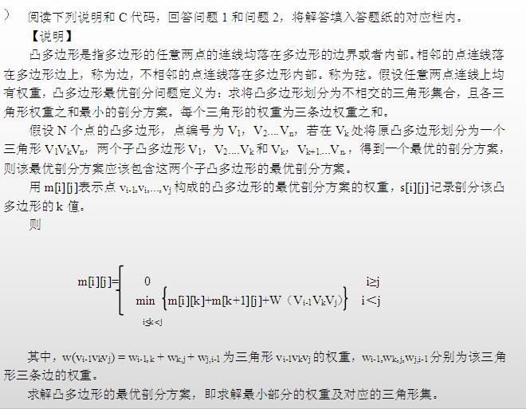
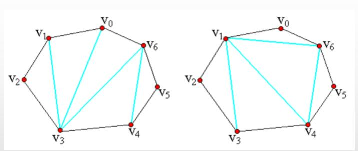
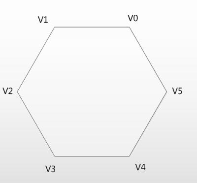
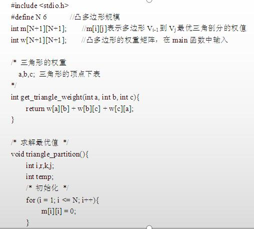
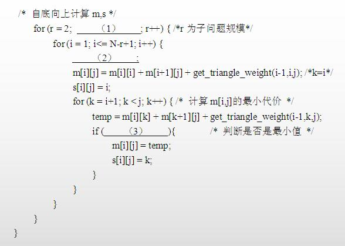
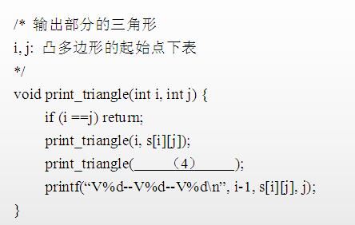

# 数据结构与算法-q-000392

## 题目

案例四（15 分）

【说明】
本题研究凸多边形的最优三角剖分：将凸多边形划分为互不相交的三角形，每个三角形的权重为其三条边权重之和。设 m[i][j] 表示子多边形的最优剖分权重，s[i][j] 记录最优划分位置，采用自底向上的动态规划计算所有子问题。

【问题2】（7 分）
根据说明和 C 代码，该算法采用的设计策略为（5），算法的时间复杂度为（6），空间复杂度为（7）（用 O 表示）。

