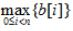
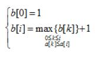

# 数据结构与算法-q-000394

## 题目

试题四（15分）
阅读下列说明和C代码，回答问题，将解答填入答题纸的对应栏内。
【说明】
计算一个整数数组a的最长递增子序列长度的方法描述如下：
假设数组a的长度为n，用数组b的元素b[i]记录以a[i](0≤i<n”)为结尾元素的最长递增子序列的长度为
；其中b[i]满足最优子结构，可递归定义为：

【C代码】
 下面是算法的C语言实现。
（1）常量和变量说明
a：长度为n的整数数组，待求其最长递增子序列
  b：长度为n的数组，b[i]记录以a[i](0≤i<n)为结尾元素的最长递增子序列的长
度，其中0≤i<n len：最长递增子序列的长度="None" i,j：循环变量="None" temp：临时变量="None" （2）c程序="None" #include="None" &lt;stdio.h="None">
int maxL(int*b, int n) {
int i, temp=0;
for(i=0; （1）; i++) {

    if(b[i]>temp)
      temp=b[i];
  }
  return temp;
}
int main() {
  int n, a[100], b[100], i, j, len;
  scanf("%d", &n);
  for(i=0; i<n; i++) {
    scanf("%d", &a[i]);
  }
    b[0]=1;
  for(i=1; i<n; i++) {
    for(j=0, len=0;     (2)    ; j++) {
      if( a[j]<=a[i]&& （3）)
        len=b[j];
    }
        (4)    ;
  }
  printf("len:%d\n", maxL(b,n));
  printf("\n");
}

【问题2】（7分）
    根据说明和C代码，算法采用了 （5） 设计策略，时间复杂度为 （6） （用O符号表示）。

