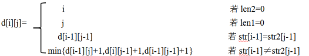
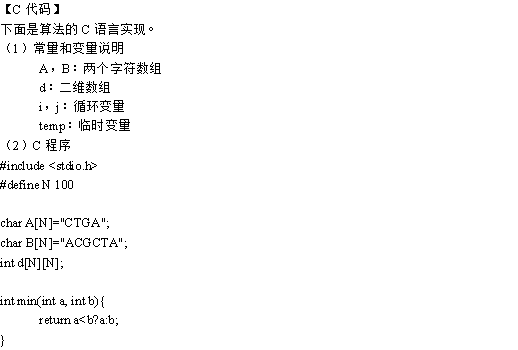
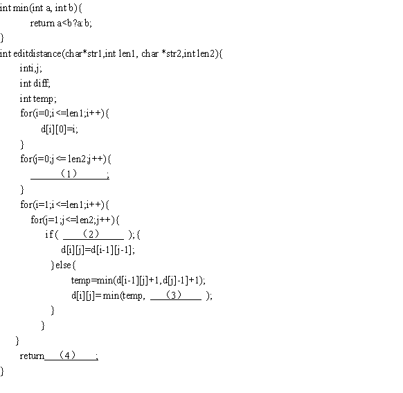

# 数据结构与算法-q-000395

## 题目

试题四（共15分）
  阅读下列说明和C代码，回答问题1至问题3,将解答写答题纸的对应栏内。
【说明】
  生物学上通常采用编辑距离来定义两个物种DNA序列的相似性，从而刻画物种之间的进化关系。具体来说，编辑距离是指将一个字符串变换为另一个字符所需要的最小操作次数。操作有三种，分别为:插入一个字符、删除一个字符以及将一个字符修改为另一个字符。
 用字符数组str1和str2分别表示长度分别为len1和len2的字符串，定义二维数组d记录求解编辑距离的子问题最优解，则该二维数组可以递归定义为：

【问题2】 (4分)
  根据说明和C代码，算法采用了(5)设计策略，时间复杂度为(6)(用O符号表示，两个字符串的长度分别用m和n表示)。

