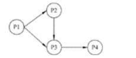
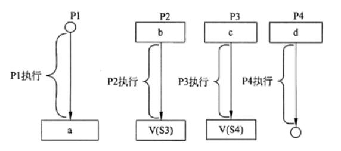

# 操作系统-q-000408

## 题目

进程P1、P2、P3和P4的前驱图如下：

若用PV操作控制这几个进程并发执行的过程，则需要设置4个信号量S1、S2、S3和S4，且信号量初值都等于零。下图中a和b应分别填写（请作答此空），c和d应分别填写（2）。

## 选项

- **A.** P(S1)P(S2)和P(S3)

- **B.** P(S1)P(S2)和V(S1)

- **C.** V(S1)V(S2)和P(S1)

- **D.** V(S1)V(S2)和V(S3)

## 参考答案

- **C.** V(S1)V(S2)和P(S1)
