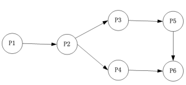
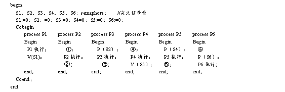

# 操作系统-q-000413

## 题目

进程 P1、P2、P3、P4、P5 和 P6 的前趋图如下所示。用 PV 操作控制这 6 个进程之间同步与互斥的程序如下，程序中的空①和空②处应分别为（问题 1），空③和空④处应分别为（问题 2），空⑤和空⑥处应分别为（问题 3）。

## 选项

- **A.** V(S3)和P(S3)

- **B.** V(S4)和P(S3)

- **C.** P(S3)和P(S4)

- **D.** V(S4)和P(S4)

## 参考答案

- **B.** V(S4)和P(S3)
