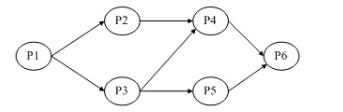
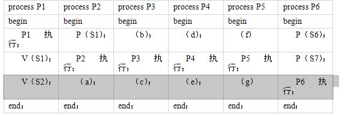

# 操作系统-q-000417

## 题目

进程 P1、P2、P3、P4、P5 和 P6 的前趋图如下所示：

若用PV操作控制这6个进程的同步与互斥的程序如下，那么程序中的空a、空b和空c处应分别为（请作答此空）；空d和空e处应分别为（2）；空f和空g处应分别为（3）。
begin
  S1，S2，S3，S4，S5，S6，S7：semaphore；   //定义信号量
  S1:=0；S2：=0；S3:=0；S4=0；S5:=0；S6:=0；S7:=0；
  Cobegin

 Coend；
end

## 选项

- **A.** V(S3)、P(S2) 和 V(S4)V(S5)

- **B.** P(S3)、P(S2) 和 V(S4)V(S5)

- **C.** V(S2)、P(S3) 和 P(S4)P(S3)

- **D.** V(S2)、V(S3) 和 P(S3)P(S4)

## 参考答案

- **A.** V(S3)、P(S2) 和 V(S4)V(S5)
