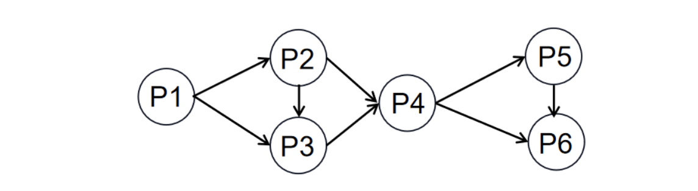
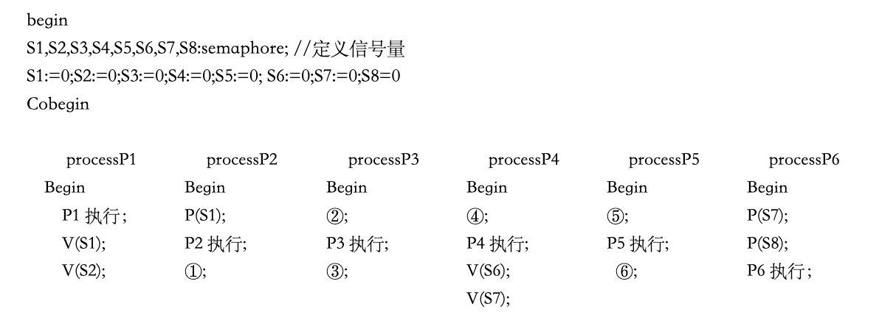

# 操作系统-q-000422

## 题目

进程P1、P2、P3、P4、P5和P6的前趋图如下所示:

若用PV操作控制进程 P1、P2、P3、P4、P5和P6并发执行的过程，需要设置8个信号量S1、S2、S3、S4、S5、S6、S7和S8， 且信号量 S1~S8 的初值都等于零。下面P1~P6的进程执行过程中，①和②处应分别填写（请作答此空）；③和④处应分别填写(27)：⑤和⑥处应分别填写(28)。

## 选项

- **A.** P (S1) P (S2) 和V(S3)V(S4)

- **B.** P(S1) P(S2)和V(S1)V(S2)

- **C.** V (S3)V(S4)和P(S1) P (S2)

- **D.** V(S3)V(S4)和P(S2)P(S3)

## 参考答案

- **D.** V(S3)V(S4)和P(S2)P(S3)
