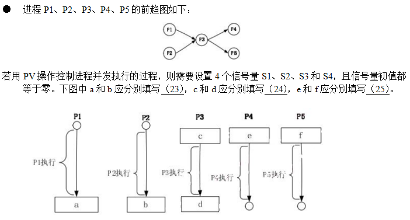

# 操作系统-q-000426

## 题目

## 选项

- **A.** P（S1）、P（S2）和 V（S3）、V（S4）

- **B.** P（S1）、P（S2）和 P（S3）、P（S4）

- **C.** V（S1）、V（S2）和 P（S3）、P（S4）

- **D.** V（S1）、V（S2）和 V（S3）、V（S4）

## 参考答案

- **A.** P（S1）、P（S2）和 V（S3）、V（S4）
