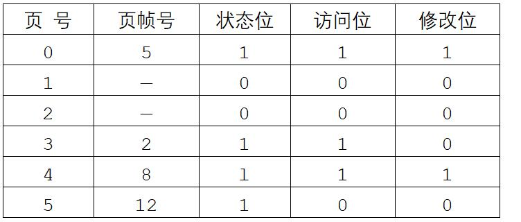

# 操作系统-q-000443

## 题目

某系统采用请求页式存储管理方案，假设某进程有6个页面，系统给该进程分配了4个存储块，其页面变换表如下表所示，表中的状态位等于I/O分别表示页面在内存/不在内存。当该进程访问的页面2不在内存时，应该淘汰表中页号为（1）的页面。假定页面大小为4K，逻辑地址为十六进制3C18H，该地址经过变换后的页帧号为（请作答此空） 。

## 选项

- **A.** 2

- **B.** 5

- **C.** 8

- **D.** 12

## 参考答案

- **A.** 2
