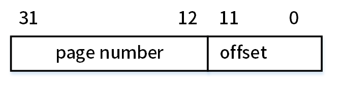

# 操作系统-q-000445

## 题目

在分页管理系统中，逻辑地址由页面编号和偏移值构成。如下所示的逻辑地址表示，（）。

## 选项

- **A.** 页面大小为2K，每个页面最大为8M

- **B.** 页面大小为4K，每个页面最大为1M

- **C.** 页面大小为8K，每个页面最大为2M

- **D.** 页面大小为1K，每个页面最大为16M

## 参考答案

- **B.** 页面大小为4K，每个页面最大为1M
