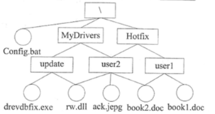

# 操作系统-q-000458

## 题目

若某文件系统的目录结构如下图所示，假设用户要访问文件book2.doc，且当前工作目录MyDrivers，则该文件的绝对路径和相对路径分别为 （请作答此空） ，若要把当前工作目录切换到Hotfix，需要执行命令 （2） 。

## 选项

- **A.** `MyDrivers\user2\` 和 `\user2\`

- **B.** `\MyDrivers\user2\` 和 `\user2\`

- **C.** `\MyDrivers\user2\` 和 `user2\`

- **D.** `MyDrivers\user2\` 和 `user2\`

## 参考答案

- **C.** `\MyDrivers\user2\` 和 `user2\`
