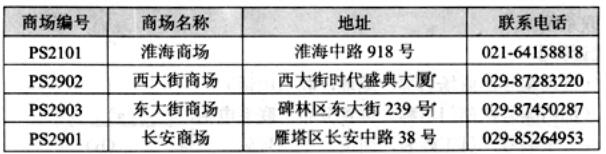
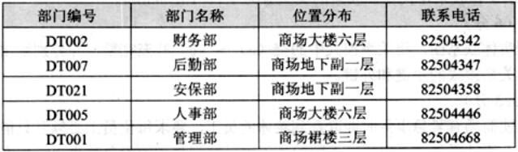
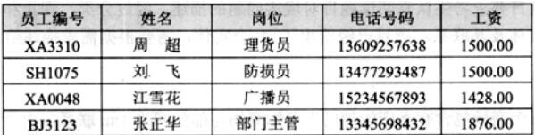
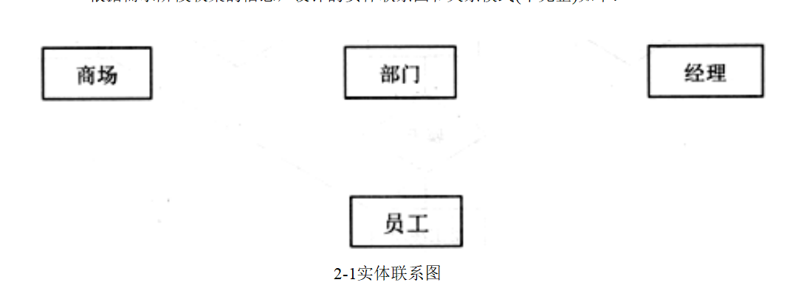

# 数据库-q-000495

## 题目

阅读下列说明，回答问题1至问题3，将解答填入的对应栏内。
【说明】
    某集团公司拥有多个大型连锁商场，公司需要构建一个数据库系统以方便管理其业务运作活动。
【需求分析结果】
 1．商场需要记录的信息包括商场编号(编号唯一)，商场名称，地址和联系电话。某商场信息如下表所示。
    商场信息表

2．每个商场包含有不同的部门，部门需要记录的信息包括部门编号(集团公司分配)，部门名称，位置分布和联系电话。某商场的部门信息如下表所示。
    部门信息表

3．每个部门雇用多名员工处理日常事务，每名员工只能隶属于一个部门(新进员工在培训期不隶属于任何部门)。员工需要记录的信息包括员工编号(集团公司分配)，姓名，岗位，电话号码和工资。员工信息如下表所示。
    员工信息表

4．每个部门的员工中有一名是经理，每个经理只能管理一个部门，系统需要记录每个经理的任职时间。
  【概念模型设计】
    根据需求阶段收集的信息，设计的实体联系图和关系模式(不完整)如下：

【关系模式设计】
    商场(商场编号，商场名称，地址，联系电话)
    部门(部门编号，部门名称，位置分布，联系电话，  (a)  )
    员工(员工编号，员工姓名，岗位，电话号码，工资，    (b)  )
    经理(  (c)   ，任职时间)

【问题3】
为了使商场有紧急事务时能联系到轮休的员工，要求每位员工必须且只能登记一位紧急联系人的姓名和联系电话，不同的员工可以登记相同的紧急联系人。则在图2-1中还需添加的实体是 (1) ，该实体和图2-1中的员工存在 (2) 联系(填写联系类型)。给出该实体的关系模式。

