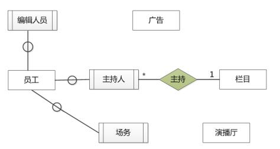

# 数据库-q-000496

## 题目

试题二（15分）
某电视台拟开发一套信息管理系统，以方便对全台的员工、栏目、广告和演播厅等进行管理。
[需求分析]
系统需要维护全台员工的详细信息、栏目信息、广告信息和演播厅信息等。员工的信息主要包括：工号、姓名、性别、出生日期、电话、住址等。栏目信息主要包括：栏目名称、播出时间、时长等。广告信息主要包括：广告编号、价格等。演播厅信息包括：房间号、房间面积等。
电视台分局调度单来协调各档栏目、演播厅和场务。一销售档栏目只会占用一个演播厅，但会使用多名场务来进行演出协调。演播厅和场务可以被多个栏目循环使用。电视台根据栏目来插播广告。每档栏目可以插播多条广告，每条广告也可以在多档栏目插播。一档栏目可以有多个主持人，但一名支持人只能支持一档栏目。一名编辑人员可以编辑多条广告，一条广告只能由一名编辑人员编辑。
[概念模型设计]
根据需求阶段收集的信息设计的实体联系图(不完整)如图所示。

[逻辑结构设计]
根据概念模型设计阶段完成的实体联系图，得出如下关系模式(不完整)：
演播厅(房间号，房间面积)
栏目(栏目名称，播出时间，时长)
广告(广告编号，销售价格，（a）)
员工(（b），姓名，性别，出生日期，电话，住址)
主持人(（c），栏目名称）
插播单(栏目名称，（d），播出时间)
调度单(栏目名称，（e），场务工号)

【问题1】（4分）
根据问题描述，补充缺失的联系，完善题干的实体联系图，联系名可用联系1、联系2、联系3和联系4代替，联系的类型为1 ：1、1∶n和m∶ n（或1∶ 1、1∶*和*:*）

