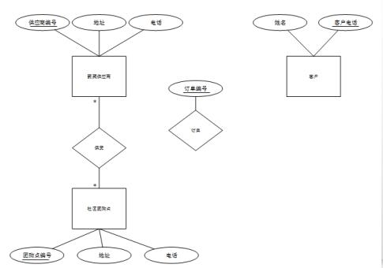

# 数据库-q-000497

## 题目

案例二（15分）
阅读下列说明，回答问题1至问题3，将解答填入答题纸的对应栏内。
【说明】
某社区蔬菜团购网站，为规范商品收发流程，便于查询客户订单情况，需要开发一个信息系统，请根据下列需求描述完成该系统的数据库设计。
【需求描述】
（1） 记录蔬菜供应商的信息，包括供应商编号，地址和一个电话
（2） 记录社区团购点的信息，包括团购点编号、地址和一个电话。
（3）记录客户信息，包括客户姓名和一个电话，客户可以在不同的社区团购点下订单，不直接与蔬菜供应商发生联系。
（4） 记录客户订单信息，包括订单编号、团购点编号、客户电话、订单内容和日期。
【概念模型设计】
根据需求阶段收集的信息，设计的实体联系图（不完整）如图2-1所示。

【逻辑结构设计】
根据概念模型设计阶段完成的实体联系图，得出如下关系模型（不完整）：
蔬菜供应商 （供应商编号，地址，电话）
社区团购点（团购点编号，地址，电话）
供货（供应商编号，（a））
客户（姓名，客户电话）
订单（订单编号，团购点编号，（b），订单内容，日期）

【问题1】（6分）
根据问题描述，补充2-1的实体联系图

