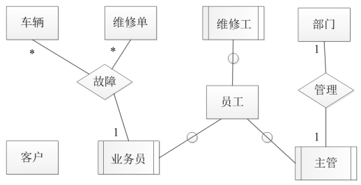

# 数据库-q-000498

## 题目

试题二(共15分)
回答问题1至问题4，将解答填入答题纸的对应栏内
【说明】
某汽车维修公司为了便于管理车辆的维修情况，拟开发一 套汽车维修管理系统，请根据下述需求描述完成该系统的数据库设计。
【需求描述】
(1)客户信息包括:客户号、客户名、客户性质、折扣率、联系人、联系电话。客户性质有个人或单位。客户号唯一标识客户关系中的每一个元组。
(2)车辆信息包括：车牌号、车型、颜色和车辆类别。一个客户至少有一辆车，一辆车只属于一个客户。
(3)员工信息包括：员工号、员工名、岗位、电话、家庭住址。其中，员工号唯一标识员工关系中的每一个元组。岗位有业务员、维修工、主管。业务员根据车辆的故障情况填写维修单。
(4)部门信息包括：部门号、名称、主管和电话，其中部门号唯一-确定 部门关系的每一个元组。 每个部门只有一名主管，但每个部门有多名员工，每名员工只属于一个部门。
(5)维修单信息包括：维修单号、车牌号、维修内容、工时。维修单号唯一标识维修单关系中的每一个元组。一个维修工可接多张维修单，但一张维修单只对应一个维修工。
【概念模型设计】根据需求阶段收集的信息，设计的实体联系图(不完整)如图2-1所示。

【逻辑结构设计】
根据概念模型设计阶段完成的实体联系图，得出如下关系模式(不完整)：
客户(客户号，客户名，(a)；折扣率，联系人，联系电话)
车辆(车牌号，(b)，车型，颜色，车辆类别)
员工(员工号，员工名，岗位，(c) ，电话，家庭住址)
部门(部门号，名称，主管，电话)
维修单(维修单号，(d)， 维修内容， 工时)

【问题1】 (6分)
根据问题描述，补充3个联系，完善图2-1的实体联系图。联系名可用联系1、联系2和联系3代替，联系的类型为1:1、1:n和m:n (或1:1、1:*和*.*)。

