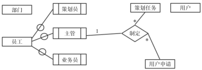

# 数据库-q-000499

## 题目

试题二（15分）
阅读下列说明，回答问题1至问题3，将解答填入答题纸的对应栏内。
【说明】
M公司为了便于开展和管理各项业务活动，提高公司的知名度和影响力，拟构建一个基于网络的会议策划系统。
【需求分析结果】
该系统的部分功能及初步需求分析的结果如下：
（1）M公司旗下有业务部、策划部和其他部门。部门信息包括部门号、部门名、主管、联系电话和邮箱号；每个部门只有一名主管，只负责管理本部门的工作，且主管参照员工关系的员工号；一个部门有多名员工，每名员工属于且仅属于一个部门。
（2）员工信息包括员工号、姓名、职位、联系方式和薪资。职位包括主管、业务员、策划员等。业务员负责受理用户申请，设置受理标志。一名业务员可以受理多个用户申请，但一个用户申请只能由一名业务员受理。
（3）用户信息包括用户号、用户名、银行账号、电话、联系地址。用户号唯一标识用户信息中的每一个元组。
（4）用户申请信息包括申请号、用户号、会议日期、天数、参会人数、地点、预算和受理标志。申请号唯一标识用户申请信息中的每一个元组，且一个用户可以提交多个申请，但一个用户申请只对应一个用户号。
（5）策划部主管为已受理的用户申请制定会议策划任务。策划任务包括申请号、任务明细和要求完成时间。申请号唯一标识策划任务的每一个元组。一个策划任务只对应一个已受理的用户申请，但一个策划任务可由多名策划员参与执行，且一名策划员可以参与执行多项策划任务。
【概念模型设计】
根据需求阶段收集的信息，设计的实体联系图（不完整）如图2-1所示。

                             图2-1  实体联系图
【关系模型设计】
部门（部门号，部门名，部门主管，联系电话，邮箱号）
员工（员工号，姓名，（a），联系方式，薪资）
用户（用户号，（b），电话，联系地址）
用户申请（申请号，用户号，会议日期，天数，参会人数，地点，受理标志，（c））
策划任务（申请号，任务明细，（d））

【问题1】（5分）
根据问题描述，补充五个联系，完善图2-1的实体联系图。联系名可用联系1、联系2、联系3、联系4和联系5，联系的类型为1:1、1:n和m:n（或1:1、1:*和*:*）。

