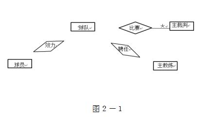

# 数据库-q-000500

## 题目

试题二
阅读下列说明，回答问题1至问题3，将解答填入答题纸的对应栏内。
【说明】
某省针对每年举行的足球联赛，拟开发一套信息管理系统，以方便管理球队、球员、主教练、主裁判、比赛等信息。
【需求分析】
(1)系统需要维护球队、球员、主教练、主裁判、比赛等信息。
球队信息主要包括：球队编号、名称、成立时间、人数、主场地址、球队主教练。
球员信息主要包括：姓名、身份证号、出生日期、身高、家庭住址。
主教练信息主要包括：姓名、身份证号、出生日期、资格证书号、级别。
主裁判信息主要包括：姓名、身份证号、出生日期、资格证书号、获取证书时间、级别。
(2)每支球队有一名主教练和若干名球员。一名主教练只能受聘于一支球队，一名球员只能效力于一支球队。每支球队都有自己的唯一主场场地，且场地不能共用。
(3)足球联赛采用主客场循环制，一周进行一轮比赛，一轮的所有比赛同时进行。
(4) 一场比赛有两支球队参加，一支球队作为主队身份、另一支作为客队身份参与比赛。一场比赛只能有一名主裁判，每场比赛有唯一的比赛编码，每场比赛都记录比分和日期。
【概念结构设计】
根据需求分析阶段的信息，设计的实体联系图（不完整）如图2-1所示。

【逻辑结构设计】
根据概念结构设计阶段完成的实体联系图，得出如下关系模式（不完整）：
球队（球队编号，名称，成立时间，人数，主场地址）
球员（姓名，身份证号，出生日期，身高，家庭住址， (1) ）
主教练（姓名，身份证号，出生日期，资格证书号，级别， (2) ）
主裁判（姓名，身份证号，出生日期，资格证书号，(３)，级别）
比赛（比赛编码，主队编号，客队编号，主裁判身份证号，比分，(４)）

【问题1】（6分）
补充图2-1中的联系和联系的类型。

