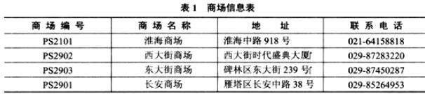
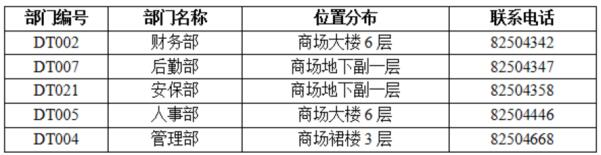
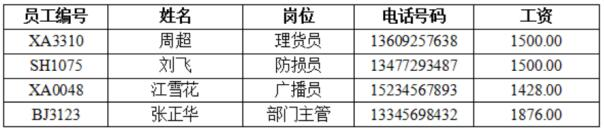

# 数据库-q-000501

## 题目

试题二（16分）
某集团公司拥有多个大型连锁商场，公司需要构建一个数据库系统便于管理其业务运作活动。
1．商场需要记录的信息包括商场编号(商场编号不重复)、商场名称、地址和联系电话。某商场信息如下表1所示。

2．每个商场包含不同的部门，部门需要记录的信息包括部门编号(不同商场的部门编号不同)、部门名称、位置分布和联系电话。某商场的部门信息如表2所示。

3．每个部门雇用了多名员工处理日常事务，每名员工只能属于一个部门(新进员工在培训期不隶属于任何部门)。员工需要记录的信息包括员工编号、姓名、岗位、电话号码和工资。员工信息如下表3所示。

4．每个部门的员工中有一个是经理，每个经理只能管理一个部门。系统要记录每个经理的任职时间。
【概念模型设计】
根据需求阶段收集的信息，设计的实体联系图和关系模式(不完整)如下：

【关系模式设计】
商场(商场编号，商场名称，地址，联系电话)
部门(部门编号，部门名称，位置分布，联系电话， (a) )
员工(员工编号，姓名，岗位，电话号码，工资， (b) )
经理( (c) ，任职时间)

[问题1] （4分）
根据问题描述，写出4个联系。联系名可用联系1、联系2、联系3和联系4代替，联系的类型分为1:1、1:n和m:n。

