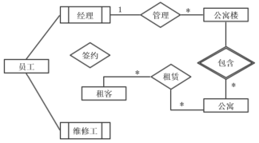

# 数据库-q-000505

## 题目

试题二（15分）
阅读下列说明，回答问题1至问题3，将解答填入答题纸的对应栏内。
【说明】
某房屋租赁公司拟开发一个管理系统用于管理其持有的房屋、租客及员工信息。请根据下述需求描述完成系统的数据库设计。
【需求描述】
1. 公司拥有多幢公寓楼，每幢公寓楼有唯一的楼编号和地址。每幢公寓楼中有多套公寓，每套公寓在楼内有唯一的编号（不同公寓楼内的公寓号可相同〉。系统需记录每套公寓的卧室数和卫生间数。
2. 员工和租客在系统中有唯一的编号（员工编号和租客编号）。
3. 对于每个租客，系统需记录姓名、多个联系电话、一个银行账号（方便自动扣房租）、一个紧急联系人的姓名及联系电话。
4. 系统需记录每个员工的姓名、一个联系电话和月工资。员工类别可以是经理或维修工，也可兼任。每个经理可以管理多幢公寓楼。每幢公寓楼必须由一个经理管理。系统需记录每个维修工的业务技能，如：水暖维修、电工、木工等。
5. 租客租赁公寓必须和公司签订租赁合同。一份租赁合同通常由一个或多个租客（合租）与该公寓楼的经理签订，一个租客也可租赁多套公寓。合同内容应包含签订日期、开始时间、租期、押金和月租金。
【概念模型设计】
根据需求阶段收集的信息，设计的实体联系图（不完整）如图2-1所示。

                          图2-1  实体联系图

【逻辑结构设计】
根据概念模型设计阶段完成的实体联系图，得出如下关系模式（不完整）：
联系电话（电话号码，租客编号）
租客（租客编号，姓名，银行账号，联系人姓名，联系人电话）
员工（员工编号，姓名，联系电话，类别，月工资，（a））
公寓楼（（b），地址，经理编号）
公寓（楼编号，公寓号，卧室数，卫生间数）
合同（合同编号，租客编号，楼编号，公寓号，经理编号，签订日期，起始日期，租期， （c），押金）

【问题1】（4.5分）
补充图2-1中的“签约”联系所关联的实体及联系类型。

