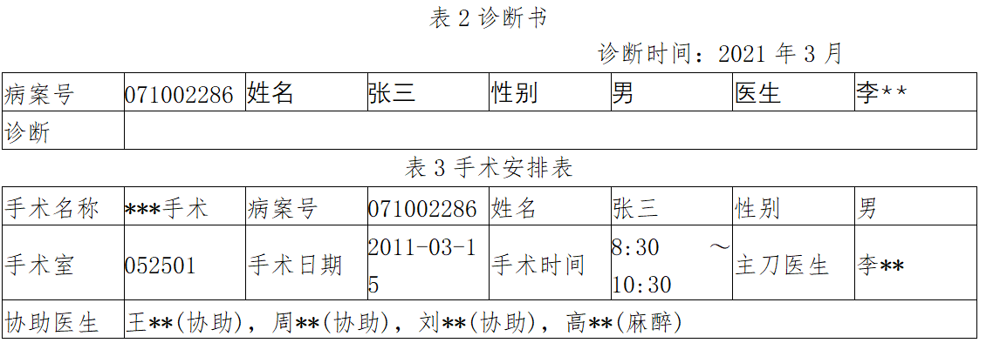
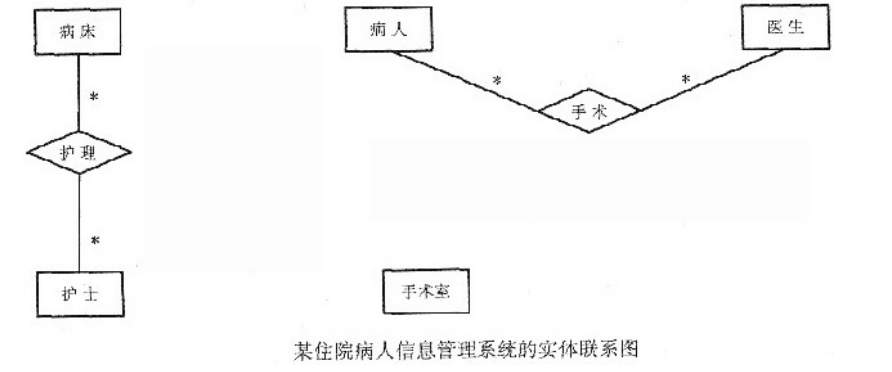

# 数据库-q-000512

## 题目

试题二（共15分）
阅读下列说明，回答问题1至问题3，将解答填入对应栏内。
【说明】
某医院拟开发一套住院病人信息管理系统，以方便对住院病人、医生、护士和手术等信息进行管理。
【需求分析】
1.系统登记每个病人的住院信息，包括病案号和病人的姓名、性别、地址、身份证号、电话号码、入院时间及病床信息等，每个病床有唯一所属的病房及病区，如表1所示。其中病案号唯一标识病人本次住院的信息

2．在一个病人的一次住院期间，由一名医生对该病人的病情进行诊断，并填写一份诊断书，如表2所示。对于需要进行一次或多次手术的病人，系统记录手术名称、手术室、手术日期、手术时间、主刀医生及多名协助医生，每名医生在手术中的责任不同，如表3所示，其中手术室包含手术室号、楼层、地点和类型等信息。

3．护士分为两类：病床护士和手术室护士。每个病床护士负责护理一个病区内的所有病人，每个病区由多名护士负责护理。手术室护士负责手术室的护理工作。每个手术室护士负责多个手术室，每个手术室由多名护士负责，每个护士在手术室中有不同的责任，并由系统记录其责任。
【概念结构设计】
根据需求阶段收集的信息，设计的实体联系图(不完整)如图1所示

【逻辑结构设计】
根据概念模型设计阶段完成的实体联系图，得出如下关系模式(不完整)：
    病床(病床号，病房，病房类型，所属病区)
    护士(护士编号，姓名，类型，性别，级别)
    病床护士(______)
    手术室(手术室号，楼层，地点，类型)
    手术室护士(______)
    病人(______，姓名，性别，地址，身份证号，电话号码，入院时间)
    医生(医生编号，姓名，性别，职称，所属科室)
    诊断书(______，诊断，诊断时间)
    手术安排(病案号，手术室号，手术时间，手术名称)
    手术医生安排(______，医生责任)

【问题3】4分
如果系统还需要记录医生给病人的用药情况，即记录医生给病人所开处方中药品的名称、用量、价格、药品的生产厂家等信息。请根据该要求，对图1进行修改，画出补充后的实体、实体间联系和联系的类型。

