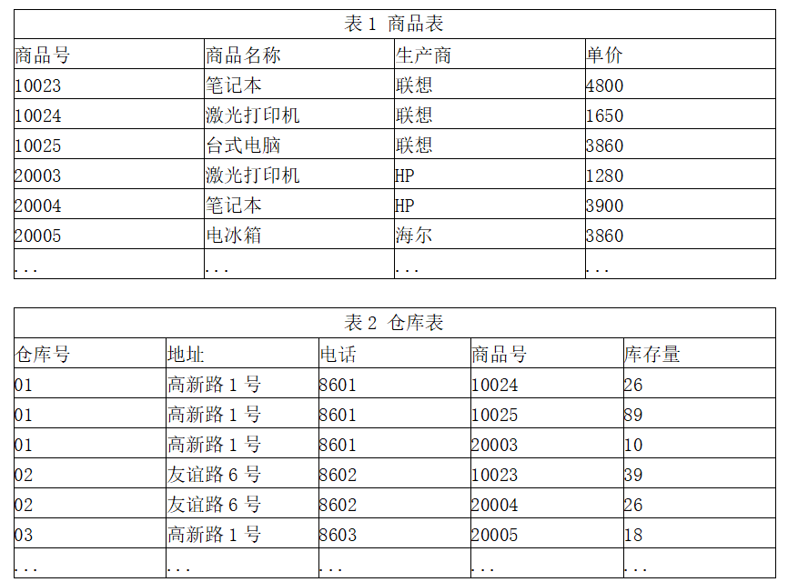

# 数据库-q-000555

## 题目

某公司的商品(商品号，商品名称，生产商，单价)和仓库(仓库号，地址，电话，商品号，库存量)两个实体之间的关系如表1和表2所示。

商品关系的主键是 （1）；仓库关系的主键是（请作答此空）；仓库关系 （3） ，为了解决这一问题，需要将仓库关系分解为 （4） 。

## 选项

- **A.** 仓库号，地址

- **B.** 仓库号，电话

- **C.** 仓库号，商品号

- **D.** 地址，电话

## 参考答案

- **C.** 仓库号，商品号
