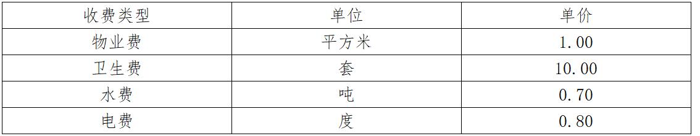
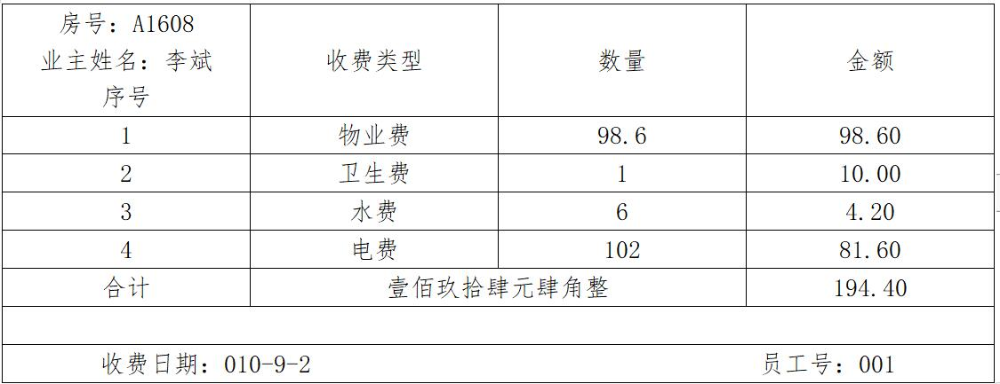
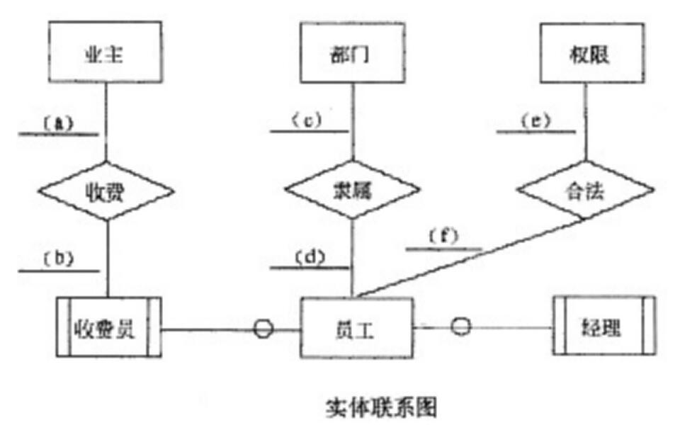

# 数据库-q-000577

## 题目

试题二（共15分）
 阅读下列说明和图，回答问题1至问题3，将解答填入对应栏内。
【说明】
    某公司拟开发一套小区物业收费管理系统。初步的需求分析结果如下：
    (1)业主信息主要包括：业主编号、姓名、房号、房屋面积、工作单位、联系电话等。房号可唯一标识一条业主信息，且一个房号仅对应一套房屋；一个业主可以有一套或多套的房屋。
    (2)部门信息主要包括：部门号、部门名称、部门负责人、部门电话等。一个员工只能属于一个部门，一个部门只有一位负责人。
    (3)员工信息主要包括：员工号、姓名、出生年月、性别、住址、联系电话、所在部门号、职务和密码等。根据职务不同，员工可以有不同的权限：职务为“经理”的员工具有更改(添加、删除和修改)员工表中本部门员工信息的操作权限；职务为“收费”的员工只具有收费的操作权限。
(4)收费信息包括：房号、业主编号、收费日期、收费类型、数量、收费金额、员工号等。收费类型包括物业费、卫生费、水费和电费，并按月收取，收费标准如表2-1所示。其中：物业费=房屋面积(平方米)×每平方米单价，卫生费=套房数量(套)×每套房单价，水费=用水数量(吨)×每吨水单价，电费=用电数量(度)×每度电单价。
表1　收费标准

(5)收费完毕应为业主生成收费单，收费单示例如表2所示。
表2　收费单示例

[概念模型设计]
    根据需求阶段收集的信息，设计的实体联系图(不完整)如图所示。图中收费员和经理是员工的子实体。

 [逻辑结构设计]
    根据概念模型设计阶段完成的实体联系图，得出如下关系模式(不完整)：
    业主(  (1)  , 姓名, 房屋面积, 工作单位, 联系电话)
    员工(  (2)  , 姓名, 出生年月, 性别, 住址, 联系电话, 职务, 密码)
    部门(  (3)  , 部门名称, 部门电诂)
    权限(职务, 操作权限)
    收费标准(  (4)   )
    收费信息(  (5)  , 收费类型, 收费金额, 员工号)

【问题3】4分
    业主关系属于第几范式?请说明存在的问题。

