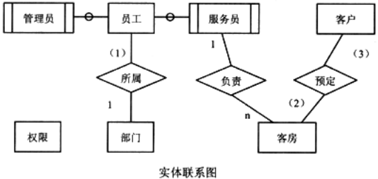

# 数据库-q-000586

## 题目

试题二（共15分）
阅读下列说明和图，回答问题1至问题4，将解答填入对应栏内。
【说明】
    某宾馆拟开发一个宾馆客房预订子系统，主要是针对客房的预订和入住等情况进行管理。
【需求分析结果】
    1．员工信息主要包括：员工号、姓名、出生年月、性别、部门、岗位、住址、联系电话和密码等信息。岗位有管理和服务两种。岗位为“管理”的员工可以更改(添加、删除和修改)员工表中本部门员工的岗位和密码，要求将每一次更改前的信息保留；岗位为“服务”的员工只能修改员工表中本人的密码，且负责多个客房的清理等工作。
    2．部门信息主要包括：部门号、部门名称、部门负责人、电话等信息。一个员工只能属于一个部门，一个部门只有一位负责人。
    3．客房信息包括：客房号、类型、价格、状态等信息。其中类型是指单人间、三人间、普通标准间、豪华标准间等；状态是指空闲、入住和维修。
    4．客户信息包括：身份证号、姓名、性别、单位和联系电话。
    5．客房预定情况包括：客房号、预定日期、预定入住日期、预定入住天数、身份证号等信息。一条预定信息必须且仅对应一位客户，但一位客户可以有多条预定信息。
【概念模型设计】
    根据需求阶段收集的信息，设计的实体联系图(不完整)如下图所示。

【逻辑结构设计】
    逻辑结构设计阶段设计的部分关系模式(不完整)如下：
    员工(  4  ，姓名，出生年月，性别，岗位，住址，联系电话，密码)
    权限(岗位，操作权限)
    部门(部门号，部门名称，部门负责人，电话)
    客房(  5  ，类型，价格，状态，入住日期，入住时间，员工号)
    客户(  6  ，姓名，性别，单位，联系电话)
    更改权限(员工号，  7  ，密码，更改日期，更改时间，管理员号)
    预定情况(  8  ，预定日期，预定入住日期，预定入住天数)

【问题1】6分
    根据问题描述，填写上图中(1)～(3)处联系的类型。联系类型分为一对一、一对多和多对多三种，分别使用1:1，1:n或1:*，m:n或*:*表示。

