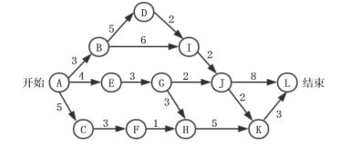

# 软件工程-q-000738

## 题目

某软件项目的活动图如下图所示，其中顶点表示项目里程碑，连接顶点的边表示包含的活动，边上的数字表示活动的持续时间（天），则完成该项目的最少时间为 （请作答此空） 天。活动BD和HK最早可以从第 （）天开始。（活动AB、AE和AC最早从第1天开始）

## 选项

- **A.** 17

- **B.** 18

- **C.** 19

- **D.** 20

## 参考答案

- **D.** 20
