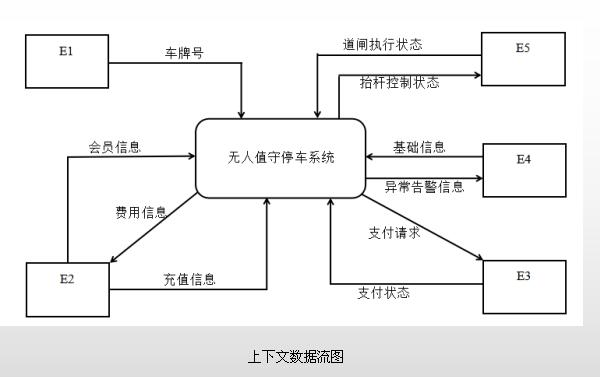
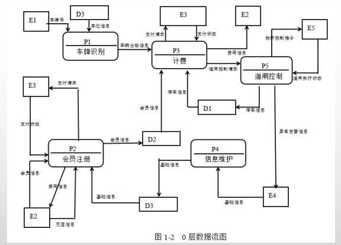

# 软件工程-q-000800

## 题目

案例一（15分）
阅读下列说明和图回答问题1至问题4，将解答填入答题纸的对应栏内。
【说明】某停车场运营方为了降低运营成本，减员增效，提供良好的停车体验，欲开发无人值守停车系统，该系统的主要功能是：
1、 信息维护。管理人员对车位（总数、空余车位数等）、计费规则等基础信息进行设置。
2、会员注册。车主提供手机号、车牌号等信息进行注册，提交充值信息（等级、绑定并授权支付系统进行充值或缴费的支付账号）；不同级别和充值额度享受不同停车折扣。
3、 车牌识别。当车辆进入停车场时，若有（空余车位数大于1），自动识别车牌号后进行道闸控制，当车主开车离开停车场时，识别车牌号，计费成功后，请求道闸控制。
4、 计费。更新车辆离场时间，根据计费规则计算出停车费用，若车主是会员，提示停车费用：若储存余额够本次停车费用，自动扣费，更新余额，若储值余额不足，自动使用授权缴费账号请求支付系统进行支付，获取支付状态。若非会员临时停车，提示停车费用，车主通过扫描费用信息中的支付码调用支付系统自助交费，获取支付状态。
5、道闸控制。根据道闸控制请求向道闸控制系统发送若干执行指令并接收道闸执行状态。若道闸执行状态为正常放行，对入场车辆，将车牌号及其入场时间信息存入停车记录，修改空余车位数；对出场车辆更新停车状态，修改空余车位数。当因道闸控制系统出现问题（断网、断电或栏杆故障等情况），无法在规定时间内接收到其返回的正常放行状态时，系统向管理人员发送异常告警信息，之后管理人员安排故障排查处理，确保车辆有序出入停车场。
现采用结构化方法对无人值守停车系统进行分析与设计，获得如图1-1所示的上下文数据流图和图1-2所示的0层数据流图。

【问题3】（4分）
根据说明和图中术语，补充图1-2中缺失的数据流及其起点和终点。

