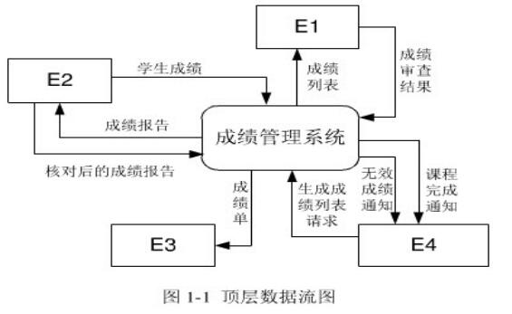
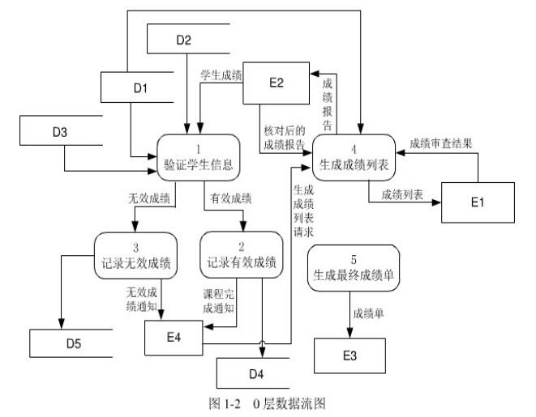

# 软件工程-q-000802

## 题目

试题一
阅读以下说明和图，回答问题1至问题4，将解答填入对应栏内。
  【说明】
    某高校欲开发一个成绩管理系统，记录并管理所有选修课程的学生的平时成绩和考试成绩，其主要功能描述如下；
    1．每门课程都有3到6个单元构成，每个单元结束后会进行一次测试，其成绩作为这门课程的平时成绩。课程结束后进行期末考试，其成绩作为这门课程的考试成绩。
    2．学生的平时成绩和考试成绩均由每门课程的主讲教师上传给成绩管理系统。
    3．在记录学生成绩之前，系统需要验证这些成绩是否有效。首先，根据学生信息文件来确认该学生是否选修这门课程，若没有，那么这些成绩是无效的：如果他的确选修了这门课程，再根据课程信息文件和课程单元信息文件来验证平时成绩是否与这门课程所包含的单元相对应，如果是，那么这些成绩是效的，否则无效。
    4．对于有效成绩，系统将其保存在课程成绩文件中。对于无效成绩，系统会单独将其保存在无效成绩文件中，并将详细情况提交给教务处。在教务处没有给出具体处理意见之前，系统不会处理这些成绩。
    5．若一门课程的所有有效的平时成绩和考试成绩都已经被系统记录，系统会发送课程完成通知给教务处，告知该门课程的成绩已经齐全。教务处根据需要，请求系统生成相应的成绩列表，用来提交考试委员会审查。
    6．在生成成绩列表之前，系统会生成一份成绩报告给主讲教师，以便核对是否存在错误。主讲教师须将核对之后的成绩报告返还系统。
    7．根据主讲教师核对后的成绩报告，系统生成相应的成绩列表，递交考试委员会进行审查。考试委员会在审查之后，上交一份成绩审查结果给系统。对于所有通过审查的成绩，系统将会生成最终的成绩单，并通知每个选课学生。
现采用结构化方法对这个系统进行分析与设计，得到如图1-1所示的顶层数据流图和图1-2所示的0层数据流图。

【问题1】4分
 使用说明中的词语，给山图l-1中的外部实体E1～E4的名称。

