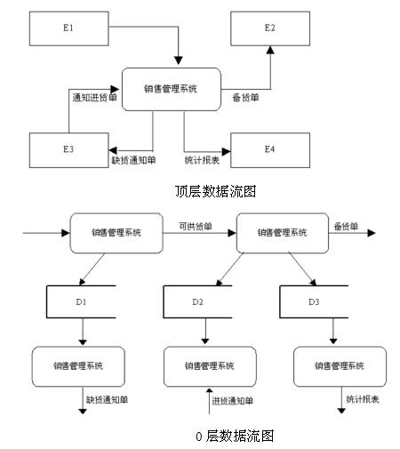

# 软件工程-q-000804

## 题目

试题一（共15分）
某营销企业拟开发一个销售管理系统，其主要功能描述如下。
    （1）接受客户订单，检查库存货物是否满足订单要求。如果满足，进行供货处理，即修改库存记录文件，给库房开具备货单并且保留客户订单至订单记录文件；否则进行缺货处理，即将缺货记录单存入缺货记录文件。
    （2）根据缺货记录文件进行缺货统计，将缺货通知单发给采购部门。
    （3）根据采购部门提供的进货通知单进行进货处理，即修改库存记录文件，并从缺货记录文件中取出缺货订单进行供货处理。
    （4）根据保留的客户订单进行销售统计，打印统计报表给经理。
现采用结构化方法对销售管理系统进行分析与设计，获得如图1-7所示的顶层数据流图和如图1-8所示的0层数据流图。

【问题2】
    使用说明中的词语，给出图1-8所示的数据存储D1-D3的名称。

