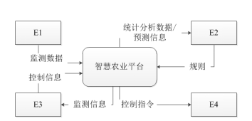
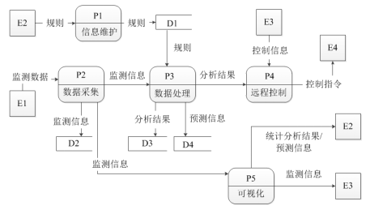

# 软件工程-q-000806

## 题目

试题一（共 15 分）
阅读下列说明和图，回答问题 1 至问题 4，将解答填入答题纸的对应栏内。
【说明】某现代农业种植基地为进一步提升农作物种植过程的智能化，欲开发智慧农业平台，集管理和销售于一体，该平台的主要功能有：
1. 信息维护。农业专家对农作物、环境等监测数据的监控处理规则进行维护。
2. 数据采集。获取传感器上传的农作物长势、土壤详情、气候等连续监测数据，解析后将监测信息进行数据处理、可视化和存储等操作。
3. 数据处理。对实时监测信息根据监控处理规则进行监测分析，将分析结果进行可视化并进行存储、远程控制；对历史监测信息进行综合统计和预测，将预测信息进行可视化和存储。
4. 远程控制。根据监控处理规则对分析结果进行判定，依据判定结果自动对控制器进行远程控制。平台也可以根据农业人员提供的控制信息对控制器进行远程控制。
5. 可视化。实时向农业人员展示监测信息；实时给农业专家展示统计分析结果和预测信息或根据农业专家请求进行展示。
现采用结构化方法对智慧农业平台进行分析与设计，获得如图1-1所示的上下文数据流图和图1-2所示的0层数据流图。

图 1-1 上下文数据流图

图 1-2 0 层数据流图

【问题 2】（4 分）
使用说明中的词语，给出图 1-2 中的数据存储 D1～D4 的名称。

