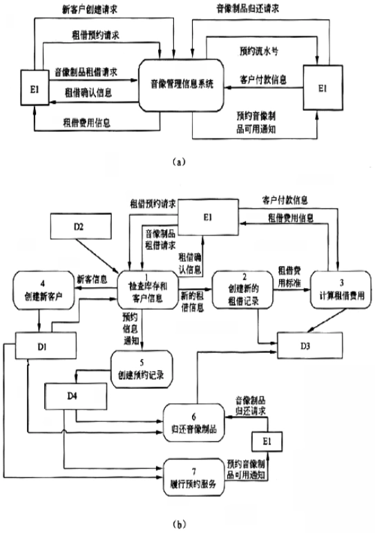

# 软件工程-q-000809

## 题目

试题一（共15分）
阅读以下说明和图，回答问题1至问题4，将解答填入对应栏内。
【说明】
    某音像制品出租商店欲开发一个音像管理信息系统，管理音像制品的租借业务。需求如下：
    1．系统中的客户信息文件保存了该商店的所有客户的用户名、密码等信息。对于首次来租借的客户，系统会为其生成用户名和初始密码。
    2．系统中音像制品信息文件记录了商店中所有音像制品的详细信息及其库存数量。
    3．根据客户所租借的音像制品的品种，会按天收取相应的费用。音像制品的最长租借周期为1周，每位客户每次最多只能租借6件音像制品。
    4．客户租借某种音像制品的具体流程如下。
    1根据客户提供的用户名和密码，验证客户身份。
    2若该客户是合法客户，查询音像制品信息文件，查看商店中是否还有这种音像制品。
    3若还有该音像制品，且客户所要租借的音像制品数小于等于6个，就可以将该音像制品租借给客户。这时，系统给出相应的租借确认信息，生成一条新的租借记录并将其保存在租借记录文件中。
    4系统计算租借费用，将费用信息保存在租借记录文件中并告知客户。
    5客户付清租借费用之后，系统接收客户付款信息，将音像制品租借给该客户。
    5．当库存中某音像制品数量不能满足客户的租借请求数量时，系统可以接受客户网上预约租借某种音像制品。系统接收到预约请求后，检查库存信息，验证用户身份，创建相应的预约记录，生成预约流水号给该客户，并将信息保存在预约记录文件中。
    6．客户归还到期的音像制品，系统修改租借记录文件，并查询预约记录文件和客户信息文件，判定是否有客户预约了这些音像制品。若有，则生成预约提示信息，通知系统履行预约服务，系统查询客户信息文件和预约记录文件，通知相关客户前来租借音像制品。

【问题1】2分
    图(a)中只有一个外部实体E1。使用【说明】中的词语，给出E1的名称。

