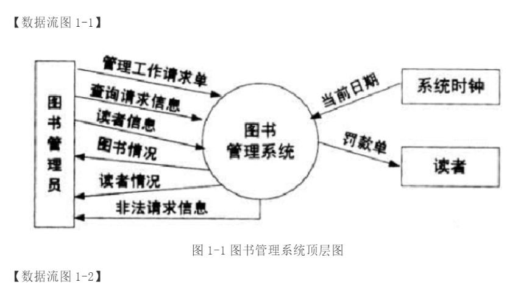
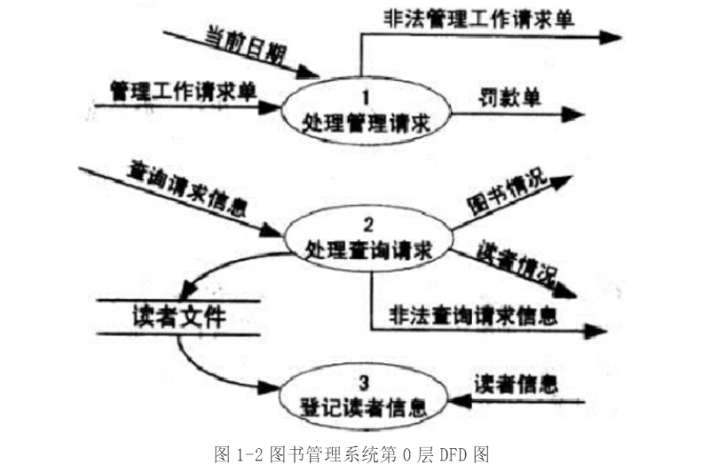
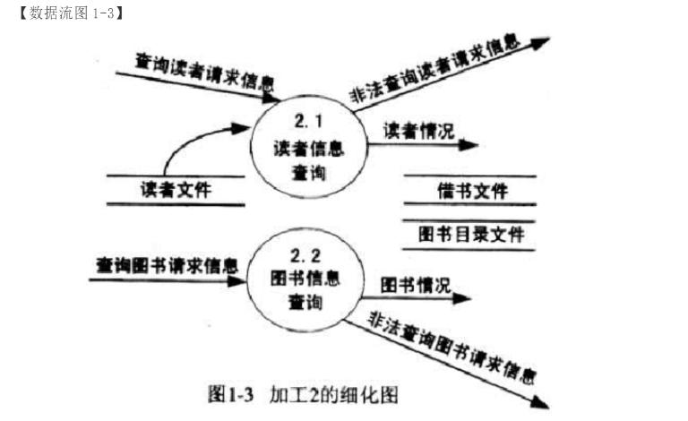

# 软件工程-q-000812

## 题目

试题一（15分）
阅读下列说明和数据流图，回答问题1至问题3，将解答填入答题纸的对应栏内。
【说明】
某图书管理系统的主要功能是图书管理和信息查询。对于初次借书的读者，系统自动生成读者号，并与读者基本信息（姓名、单位、地址等）一起写入读者文件。
系统的图书管理功能分为四个方面：购入新书、读者借书、读者还书以及图书注销。
1. 购入新书时需要为该书编制入库单。入库单内容包括图书分类目录号、书名、作者、价格、数量和购书日期，将这些信息写入图书目录文件并修改文件中的库存总量（表示到目前为止购入此种图书的数量）。
2. 读者借书时需填写借书单。借书单内容包括读者号和所借图书分类目录号。系统首先检查该读者号是否有效，若无效，则拒绝借书；若有效，则进一步检查该读者已借图书是否超过最大限制数（假设每位读者能同时借阅的书不超过 5 本）。若已达到最大限制数，则拒绝借书；否则允许借书，同时将图书分类目录号、读者号和借阅日期等信息写入借书文件中。
3. 读者还书时需填写还书单。系统根据读者号和图书分类目录号，从借书文件中读出与该图书相关的借阅记录，标明还书日期，再写回到借书文件中；若图书逾期，则处以相应的罚款。
4.  注销图书时，需填写注销单并修改图书目录文件中的库存总量。系统的信息查询功能主要包括读者信息查询和图书信息查询。其中，读者信息查询可得到读者的基本信息以及读者借阅图书的情况；图书信息查询可得到图书基本信息和图书的借出情况。图书管理系统的顶层图如图 1-1 所示；图书管理系统的第 0 层 DFD 图如图 1-2 所示，其中加工 2 的细化图如图 1-3 所示。

【问题3】
根据系统功能和数据流图填充下列数据字典条目中的（1）和（2）∶
查询请求信息=【查询读者请求信息| 查询图书请求信息】
读者情况=读者号+姓名+所在单位+{借书情况}
管理工作请求单=  (1)
入库单=  (2)

