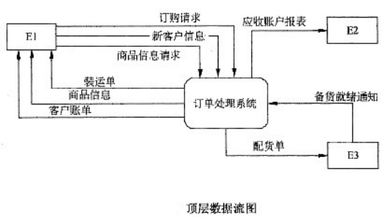
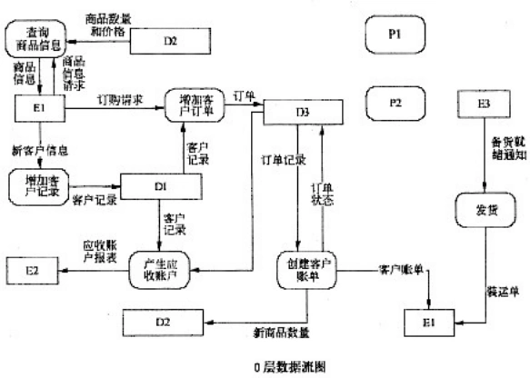

# 软件工程-q-000813

## 题目

试题一（共15分）
 阅读以下说明和图，回答问题1至问题4，将解答填入对应栏内。
  【说明】
    某时装邮购提供商拟开发订单处理系统，用于处理客户通过电话、传真、邮件或Web站点所下订单。其主要功能如下：
    (1)增加客户记录。将新客户信息添加到客户文件，并分配一个客户号以备后续使用。
    (2)查询商品信息。接收客户提交的商品信息请求，从商品文件中查询商品的价格和可订购数量等商品信息，返回给客户。
    (3)增加订单记录。根据客户的订购请求及该客户记录的相关信息，产生订单并添加到订单文件中。
    (4)产生配货单。根据订单记录产生配货单，并将配货单发送给仓库进行备货；备好货后，发送备货就绪通知。如果现货不足，则需向供应商订货。
    (5)准备发货单。从订单文件中获取订单记录，从客户文件中获取客户记录，并产生发货单。
    (6)发货。当收到仓库发送的备货就绪通知后，根据发货单给客户发货；产生装运单并发送给客户。
    (7)创建客户账单。根据订单文件中的订单记录和客户文件中的客户记录，产生并发送客户账单，同时更新商品文件中的商品数量和订单文件中的订单状态。
    (8)产生应收账户。根据客户记录和订单文件中的订单信息，产生并发送给财务部门应收账户报表。
    现采用结构化方法对订单处理系统进行分析与设计，获得如图1-1所示的顶层数据流图和图1-2所示的0层数据流图。

【问题1】3分
使用说明中的词语，给出图1-1中的实体E1～E3的名称。

