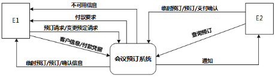
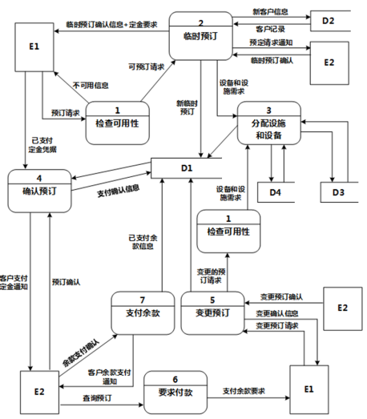

# 软件工程-q-000815

## 题目

试题一（15分）
阅读下列说明和图，回答问题1至问题4，将解答填入答题纸的对应栏内。
【说明】
某会议中心提供举办会议的场地设施和各种设备，供公司与各类组织机构租用。场地包括一个大型报告厅、一个小型报告厅以及诸多会议室。这些报告厅和会议室可提供的设备有投影仪、白板、视频播放/回放设备、计算机等。为了加强管理，该中心欲开发一会议预订系统，系统的主要功能如下。
（1）检查可用性。客户提交预订请求后，检查预订表，判定所申请的场地是否在申请日期内可用；如果不可用，返回不可用信息。
（2）临时预订。会议中心管理员收到客户预订请求的通知之后，提交确认。系统生成新临时预订存入预订表，并对新客户创建一条客户信息记录加以保存。根据客户记录给客户发送临时预订确认信息和支付定金要求。
（3）分配设施与设备。根据临时预订或变更预订的设备和设施需求，分配所需设备（均能满足用户要求）和设施，更新相应的表和预订表。
（4）确认预订。管理员收到客户支付定金的通知后，检查确认，更新预订表，根据客户记录给客户发送预订确认信息。
（5）变更预订。客户还可以在支付余款前提交变更预订请求，对变更的预订请求检查可用性，如果可用，分配设施和设备；如果不可用，返回不可用信息。管理员确认变更后，根据客户记录给客户发送确认信息。
（6）要求付款。管理员从预订表中查询距预订的会议时间两周内的预订，根据客户记录给满足条件的客户发送支付余款要求。
（7）支付余款。管理员收到客户余款支付的通知后，检查确认，更新预订表中的已支付余款信息。
现采用结构化方法对会议预订系统进行分析与设计，获得如图1-1所示的上下文数据流图和图1-2所示的0层数据流图（不完整）。

                           图1-1  上下文数据流图

                          图1-2  0层数据流图

【问题2】（4分）
使用说明中的词语，给出图1-2中的数据存储D1～D4的名称。

