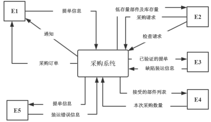
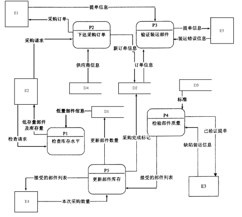

# 软件工程-q-000818

## 题目

试题一（15分）
阅读下列说明和图，回答问题1至问题4，将解答填入答题纸的对应栏内。
【说明】
某医疗器械公司作为复杂医疗产品的集成商，必须保持高质量部件的及时供应。为了实现这一目标，该公司欲开发一采购系统。系统的主要功能如下。
1. 检查库存水平。采购部门每天检查部件库存量，当特定部件的库存量降至其订货点时，返回低存量部件及库存量。
2. 下达采购订单。采购部门针对低存量部件及库存量提交采购请求，向其供应商（通过供应商文件访问供应商数据）下达采购订单，并存储于采购订单文件中。
3. 交运部件。当供应商提交提单并交运部件时，运输和接收（S/R）部门通过执行以下三步过程接收货物：
（1）验证装运部件。通过访问采购订单并将其与提单进行比较来验证装运的部件，并将提单信息发给S/R职员。如果收货部件项目出现在采购订单和提单上，则已验证的提单和收货部件项目将被送去检验。否则，将S/R职员提交的装运错误信息生成装运错误通知发送给供应商。
（2）检验部件质量。通过访问质量标准来检查装运部件的质量，并将已验证的提单发给检验员。如果部件满足所有质量标准，则将其添加到接受的部件列表用于更新部件库存。如果部件未通过检查，则将检验员创建的缺陷装运信息生成缺陷装运通知发送给供应商。
（3）更新部件库存。库管员根据收到的接受的部件列表添加本次采购数量，与原有库存量累加来更新库存部件中的库存量。标记订单采购完成。
现采用结构化方法对该采购系统进行分析与设计，获得如图1-1所示的上下文数据流图和图1-2所示的0层数据流图。

                           图1-1  上下文数据流图

                               图1-2  0层数据流图

【问题2】（4分）
使用说明中的词语，给出图1-2中的数据存储D1～D4的名称。

