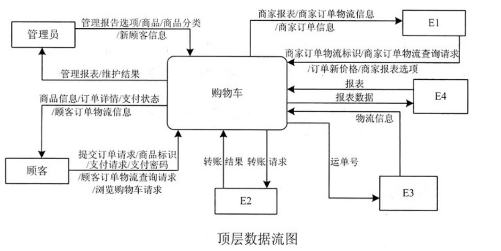
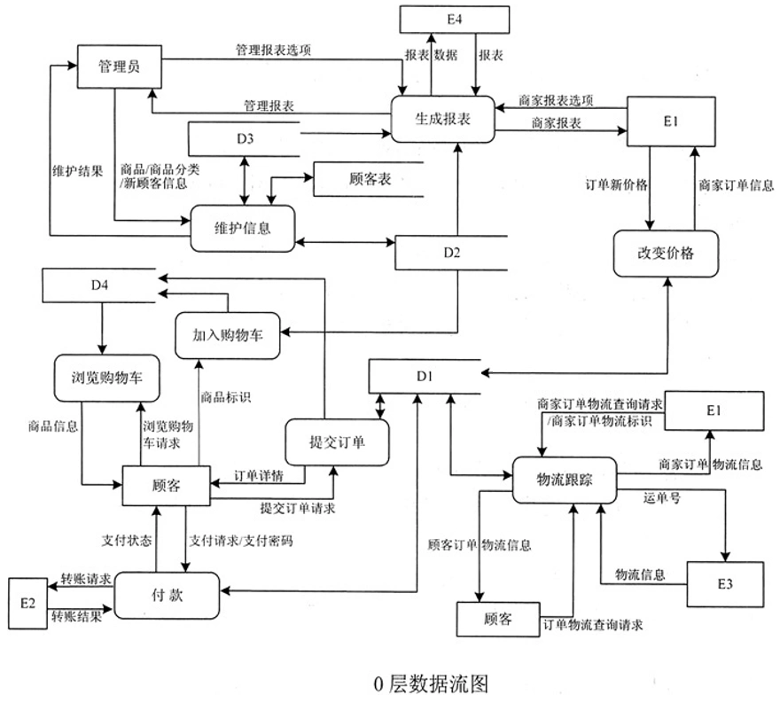

# 软件工程-q-000823

## 题目

试题一（共15分）
阅读以下说明和图，回答问题1至问题4，将解答填入对应栏内。
【说明】
某电子商务系统采用以数据库为中心的集成方式改进购物车的功能，详细需求如下。
1.加入购物车。顾客浏览商品，点击加入购物车，根据商品标识从商品表中读取商品信息，并更新购物车表。
 2．浏览购物车。顾客提交浏览购物车请求后，显示出购物车表中的商品信息。
 3．提交订单。顾客点击提交订单请求，后台计算购物车表中商品的总价(包括运费)加入订单表，将购物车表中的商品状态改为待付款，显示订单详情。若商家改变价格，则刷新后可看到更改后的价格。
 4．改变价格。商家查看订购自家商品的订单信息，根据特殊优惠条件修改价格，更新订单表中的商品价格。
 5．付款。顾客点击付款后，系统先根据顾客表中关联的支付账户，将转账请求(验证码、价格等)提交给支付系统(如信用卡系统)进行转账；然后根据转账结果返回支付状态并更改购物车表中商品的状态。
 6．物流跟踪。商家发货后，需按订单标识添加物流标识(物流公司、运单号)；然后可根据顾客或商家的标识以及订单标识，查询订单表中的物流标识，并从相应物流系统查询物流信息。
7．生成报表。根据管理员和商家设置的报表选项，从订单表、商品表以及商品分类表中读取数据，调用第三方服务Crystal Reports生成相关报表。
8．维护信息。管理员维护(增、删、改、查)顾客表、商品分类表和商品表中的信息。
现采用结构化方法实现上述需求，在系统分析阶段得到如图1-9所示的顶层数据流图和图1-10所示的0层数据流图。

【问题3】4分
     0层数据流图中缺失了数据流，请用说明或0层数据流图中的词语，给出其起点和终点。

