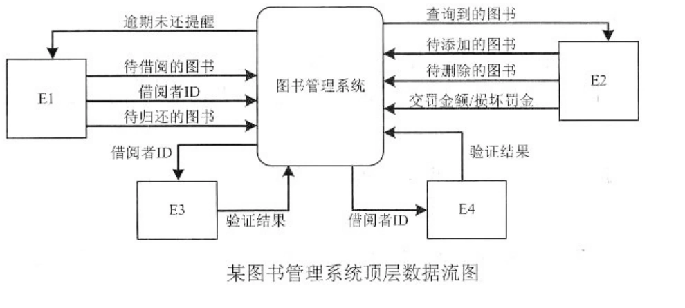
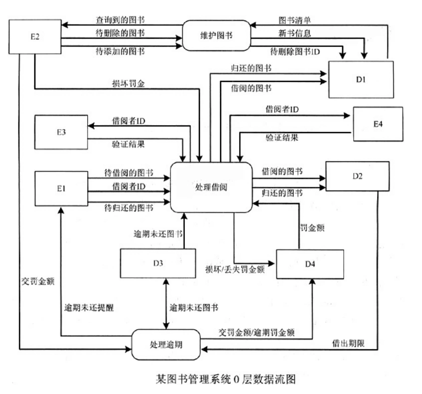

# 软件工程-q-000828

## 题目

试题一（共15分）
 阅读以下说明和图，回答问题1至问题4，将解答填入对应栏内。
  【说明】
    某学校欲开发图书管理系统，以记录图书馆所藏图书及其借出和归还情况，提供给借阅者借阅图书功能，提供给图书馆管理员管理和定期更新图书表功能。主要功能的具体描述如下：
    1处理借阅。借阅者要借阅图书时，系统必须对其身份(借阅者ID.进行检查。通过与教务处维护的学生数据库、人事处维护的职工数据库中的数据进行比对，以验证借阅者ID是否合法。若合法，则检查借阅者在逾期未还图书表中是否有逾期未还图书，以及罚金表中的罚金是否超过限额。如果没有逾期未还图书并且罚金未超过限额，则允许借阅图书，更新图书表，并将借阅的图书存入借出图书表。借阅者归还所借图书时，先由图书馆管理员检查图书是否缺失或损坏，若是，则对借阅者处以相应罚金并存入罚金表；然后，检查所还图书是否逾期，若是，执行“处理逾期”操作；最后，更新图书表，删除借出图书表中的相应记录。
    2维护图书。图书馆管理员查询图书信息；在新进图书时录入图书信息，存入图书表；在图书丢失或损坏严重时，从图书表中删除该图书记录。
    3处理逾期。系统在每周一统计逾期未还图书，逾期未还的图书按规则计算罚金，并记入罚金表，并给有逾期未还图书的借阅者发送提醒消息。借阅者在借阅和归还图书时，若罚金超过限额，管理员收取罚金，并更新罚金表中的罚金额度。
    现采用结构化方法对该图书管理系统进行分析与设计，获得如图1所示的顶层数据流图和图2所示的0层数据流图。

【问题4】2分
说明[问题3]中绘制1层数据流图时要注意的问题。

