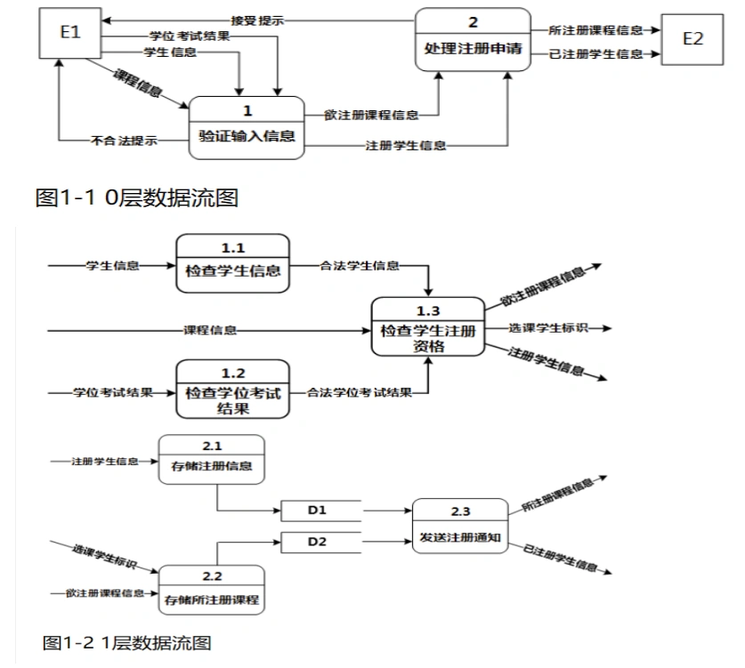

# 软件工程-q-000829

## 题目

试题一
某大学欲开发一个基于 Web 的课程注册系统。该系统的主要功能如下：
1、验证输入信息
（1）检查学生信息。检查学生输入的所有注册所需信息。如果信息不合法，返回学生信息不合法提示；如果合法，输出合法学生信息。
（2）检查学位考试信息。检查学生提供的学位考试结果。如果不合法，返回学位考试结果不合法提示；如果合法，检查该学生注册资格。
（3）检查学生资格。根据合法学生信息和合法学位考试结果，检查该学生对欲选课程的注册资格。如果无资格，返回无注册资格提示；如果有注册资格，则输出注册学生信息（包含选课学生标识）和欲注册课程信息。
2、处理注册申请
（1）存储注册信息。将注册学生信息记录在学生库。
（2）存储所注册课程。将选课学生标识与欲注册课程进行关联，然后存入课程库。
（3）发送注册通知。从学生库中读取注册学生信息，从课程库中读取所注册课程信息，给学生发送接受提示；给教务人员发送所注册课程信息和已注册学生信息。
现采用结构化方法对课程注册系统进行分析和设计，获得如图1-1所示的0层数据流图和图1-2所示的1层数据流图。

【问题1】（2分）
使用说明中的词语，给出图1-1中的实体E1和E2的名称。

