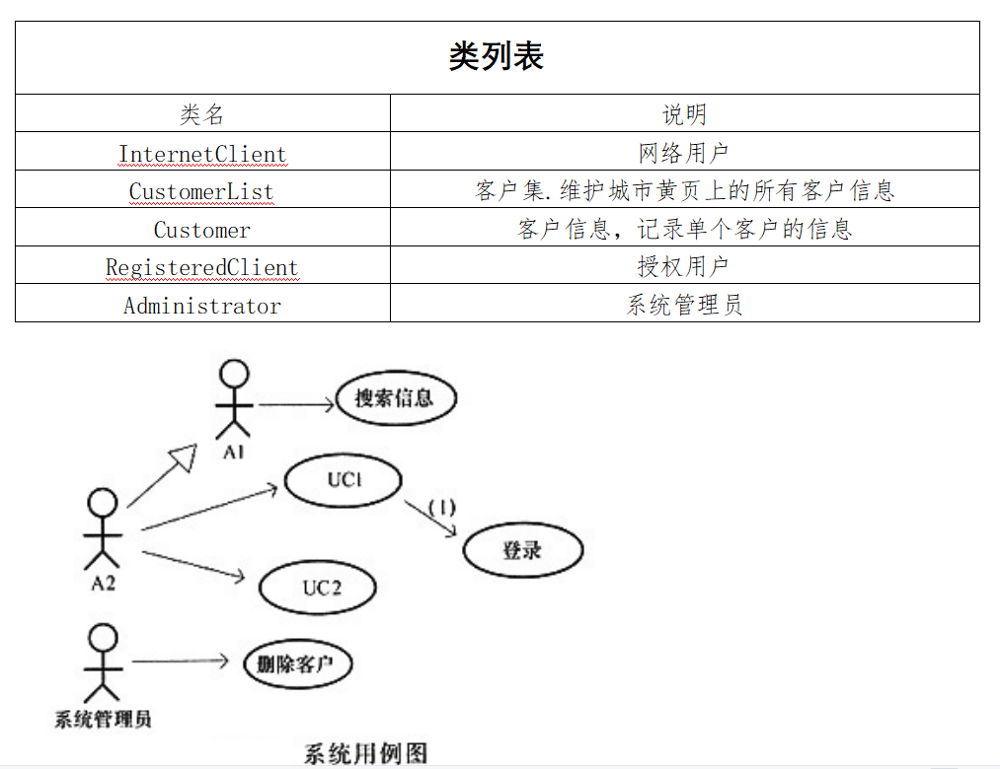
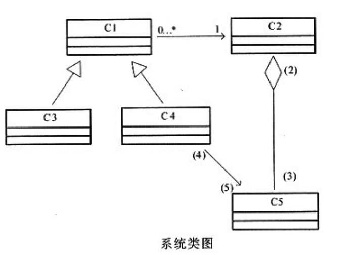

# 软件工程-q-000893

## 题目

试题三（共15分）
阅读下列说明和图，回答问题1至问题3，将解答填入对应栏内。
【说明】
某城市拟开发一个基于 Web 的城市黄页，公开发布该城市重要的组织或机构（以下统称为客户）的基本信息，方便城市生活。该系统的主要功能描述如下：
    搜索信息：任何使用Internet的网络用户都可以搜索发布在城市黄页中的信息，例如客户的名称、地址、联系电话等。
    认证：客户若想在城市黄页上发布信息，需通过系统的认证。认证成功后，该客户成为系统授权用户。
    更新信息：授权用户登录系统后，可以更改自己在城市黄页中的相关信息，例如变更联系电话等。
    删除客户：对于拒绝继续在城市黄页上发布信息的客户，有系统管理员删除该客户的相关信息。
    系统采用面向对象方法进行开发，在开发过程中认定出如下表所示的类。系统的用例图和类图分别如图1和图2所示。

【问题3】（5分）认定类是面向对象分析中非常关键的一个步骤。一般首先从问题域中得到候选类集合，再根据相应的原则从该集合中删除不作为类的，剩余的就是从问题域中认定出来的类。简要说明选择候选类的原则，以及对候选类集合进行删除的原则。

